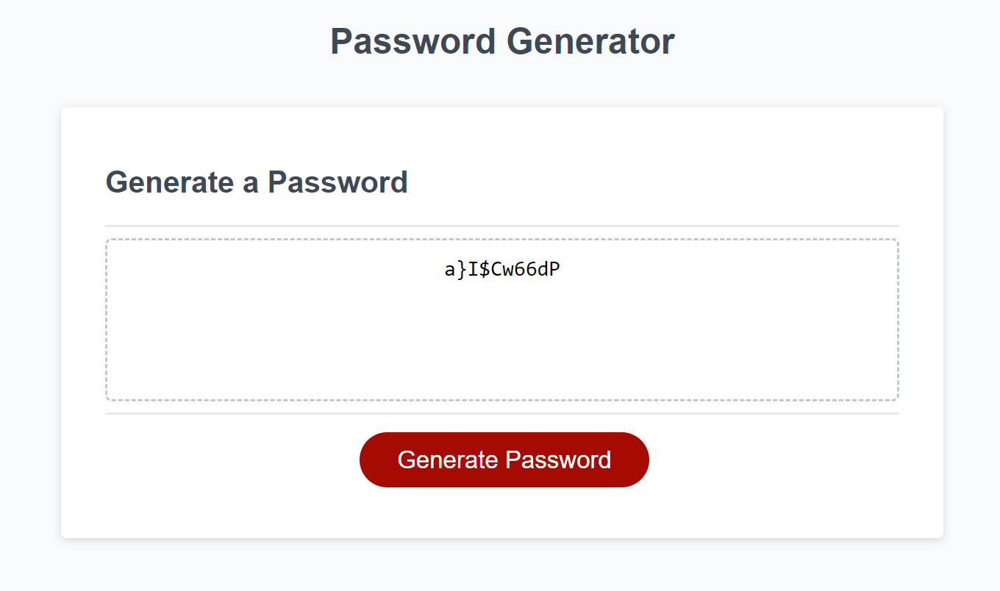
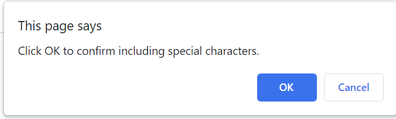

# Password Generator

## Description

This application can be used to generate a random password of at least 8 characters but no more than 128. The user can choose to include at least one of the following type of characters:
- special characters
- numeric characters
- lowercase characters
- uppercase characters

## Installation

N/A

## Usage

Access the Password Generator at the link below:
https://marinaongithub.github.io/password-generator

Click on the red button to generate the random password.

Choose the length and the type of characher you want to include in the password.

## Credits

N/A

## License

N/A
